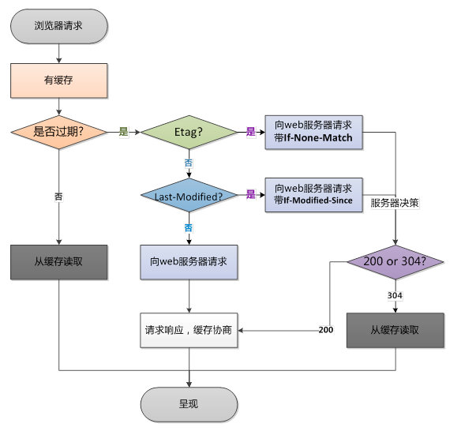

# 前端缓存

在前端开发过程中，缓存的存在能够提高界面性能。对缓存不够理解会造成很多困扰，特别是在做移动端开发的时候没有统一的清理web缓存的机制，有时候我们调试半天线上bug最后发现是缓存没有加载最新的前端代码造成。讨巧的方式是可以在主页的底部后相关位置添加版本信息，但是对大部分普通用户即使知道了版本信息也无法判断是否为最新版本；无法快速的清理缓存仍然需要咨询开发人员或运维等。

在做开发的时候就经常遇到缓存带来的困扰，特别是移动APP使用webview加载h5的时候。因为APP开发人员在webview层面是可以控制缓存机制的，这就造成了不可控的问题以及如何在新版本发布如何更新的问题。

对前端开发人员来说我们需要知道HTTP缓存和浏览器缓存。



HTTP缓存可以分为两种：强缓存和协商缓存。两者的主要区别是使用缓存的时候，是否需要向服务器验证本地缓存是否依旧有效。顾名思义，协商缓存就是需要和服务器进行协商，最终确定是否使用本地缓存。对需要频繁更新的项目来说推荐协商缓存，协商缓存虽然增加了判断逻辑但能确保有效性。

## 强缓存(一般不会像服务器发送请求)

服务端通过Cache-control(http 1.1) Expires(http 1.0)来设置，主要是通过缓存失效时间来判断处理。

Cache-control优先级高于Expires。符合缓存策略时，服务器不会发送新的资源，但不是说客户端和服务器就没有会话了，客户端还是会发送请求到服务器。Cahce-Control除了在响应中使用，在请求中也可以使用。我们使用Chrome的开发者工具勾选上`Disable cahce`刷新页面，就可以看到在所有的request headers中有个字段`Cache-Control: no-cache`
Cache-control常用属性值：
* private 私有缓存设备(浏览器，内容只在客户端缓存，也是Cache-control的默认值)
* public 公有缓存设备(如CDN，客户端和代理服务器都可缓存)
* max-age 时间段，指定缓存最大有效时间，秒为单位 在private设备中取资源，状态码200
* s-maxAge 时间段，指定缓存最大有效时间，秒为单位 在public设备中取资源 同时设置的时候优先级高于max-age 状态码304
* no-cache 会把强缓存机制改为协商缓存，会向服务器发起请求，资源是否使用缓存取决于服务端响应字段(last-modified等)
* no-store 资源不会读取缓存，表示禁止浏览器及其所有中间缓存存储任何版本的返回响应。每次用户请求该资源时，都会向服务器发送请求，并下载完整响应。

Expires属性值通常为UTC时间格式，是HTTP/1.0控制页面缓存的字段，其值为服务器返回该请求结果缓存的到期时间，即再次发送该请求时，如果客户端的时间小于Expires的值时，直接使用缓存结果。到了HTTP/1.1，Expires已经被Cache-Control替代，原因在于Expires控制缓存的原理是使用客户端的时间与服务端返回的时间做对比，那么当这两个时间本身就存在误差的情况就可能会造成强制缓存失效，那强制缓存的就失去了意义。

## 协商缓存(会向服务端发起请求，向服务端询问是否可以使用缓存)

对应的http响应 header字段有Last-modified，Etag。Last-modified原理大致如下：通过读取文件最后修改日期和请求头中`if-modified-since`做比较，如果相等的话就返回304，客户端就可以使用缓存文件，如果不相等就返回200和最新的文件，同时响应头加上`Last-modified`字段。ETag(优先级高于Last-modified)，原理大致如下：一般使用文件的版本号为属性值(也可以认为是文件的一个Hash值)，通过对比请求头中的`if-none-match`字段与文件的版本号字符来进行判断，如果没有变化就告诉客户端可以使用缓存。

**If-Modified-Since / Last-Modified**

1. 客户端第一次向服务器发起请求,服务器将最后的修改日期(Last-Modified)附加到所提供的文档上去
2. 当再一次请求资源时间,如果没有命中强缓存,在执行在验证时,会包含一个If-Modifed-Since首部,其中携带有最后修改已缓存副本的日期: If-Modified-Since: <cached last-modified data>
3. 如果内容被修改了,服务器回送新的文档,返回200状态码和最新的修改日期
4. 如果内容没有被修改,会返回一个304 Not Modified响应

**If-None-Match / ETag**

有些情况下仅使用最后修改日期进行再验证是不够的

1. 有些文档有可能会被周期性的重写(比如: 从一个后台进程中写入),但实际上包含的数据常常是一样分,尽管内容没有变化,但修改日期会发生变化
2. 有些文档可能被修改了,但所做修改并不重要.不需要让世界范围内的缓存都重装数据(比如填写注释)
3. 有些服务器无法准确判定其页面的最后修改日期
4. 有些服务器提供的文档会在毫秒间隙发生变化(比如,实时监视器),对这些服务器来说,以一秒为粒度的修改日期可能就不够用了。

## 延伸知识-Nginx有些版本同时开启gzip和etag会出现问题
nginx从1.3.3开始新加了一个etag参数，默认是打开的。但在某些版本(从nginx1.3.3到nginx1.7.3)中，当开启gzip时，会导致etag头丢失。官方给出的解释是压缩以后文件大小无法保证。自Nginx1.7.3以后，nginx在处理gzip中遇到etag头部，会将强etag自动转换为弱etag（weak ETAG），如果遇到弱etag，则不作处理原样返回。也就是说从1.7.3以后的版本同时开启gzip和etag则不会存在冲突的问题。

## 延伸知识-CDN缓存
cdn缓存是一种服务端缓存，CDN服务商将源站的资源缓存到遍布全国的高性能加速节点上，当用户访问相应的业务资源时，用户会被调度至最接近的节点最近的节点ip返回给用户，在web性能优化中，它主要起到了，缓解源站压力，优化不同用户的访问速度与体验的作用。

客户端访问网站的过程(没有CDN)：
* 用户在浏览器访问栏中输入要访问的域名
* 浏览器向DNS服务器请求对该域名的解析
* DNS服务器返回该域名的IP地址给浏览器
* 浏览器使用该IP地址向服务器请求内容
* 服务器将用户请求的内容返回给浏览器

使用了CDN:
* 用户在浏览器中输入要访问的域名
* 浏览器向DNS服务器请求对域名进行解析。由于CDN对域名解析进行了调整，DNS服务器会最终将域名的解析权交给CNAME指向的CDN专用DNS服务器
* CDN的DNS服务器将CDN的负载均衡设备IP地址返回给用户
* 用户向CDN的负载均衡设备发起内容URL访问请求
* CDN负载均衡设备会为用户选择一台合适的缓存服务器提供服务。选择的依据包括：根据用户IP地址，判断哪一台服务器距离用户最近；根据用户所请求的URL中携带的内容名称，判断哪一台服务器上有用户所需内容；查询各个服务器的负载情况，判断哪一台服务器的负载较小。基于以上这些依据的综合分析之后，负载均衡设置会把缓存服务器的IP地址返回给用户（会根据CDN提供商有不同的实现机制）
* 用户向缓存服务器发出请求
* 缓存服务器响应用户请求，将用户所需内容传送到用户。如果这台缓存服务器上并没有用户想要的内容，而负载均衡设备依然将它分配给了用户，那么这台服务器就要向它的上一级缓存服务器请求内容，直至追溯到网站的源服务器将内容拉取到本地

缓存规则：

* 首次访问，下载网站的静态资源（如：JS、CSS、图片等）到本地
* 第二次访问浏览器从缓存中加载资源，不再请求服务器，提高网站访问速度
* 使用CDN当浏览器缓存过期，浏览器不是直接向原站点请求资源，而是想CDN最近站点请求
* CDN最近站点也是有缓存的，如果缓存过期，那么就由CDN最近站点向原站点发送请求获取最新资源

CDN节点缓存机制在不同服务商中是不同的，但一般都遵循HTTP协议，通过http响应头中的Cache-Control:max-age的字段来设置CDN节点文件缓存时间。当客户端向CDN节点请求数据时，CDN会判断缓存数据是否过期，若没有过期，则直接将缓存数据返回给客户端，否则就向源站点发出请求，从源站点拉取最新数据，更新本地缓存，并将最新数据返回给客户端。

CDN缓存时间会对“回源率”产生直接的影响，若CDN缓存时间短，则数据经常失效，导致频繁回源，增加了源站的负载，同时也增大了访问延时；若缓存时间长，数据更新时间慢，因此需要针对不同的业务需求来选择特定的数据缓存管理。

## 使用案例一

移动APP使用webview的方式加载远程h5页面，为了提高加载速度APP侧使用了开启了缓存，H5发布了新版本无法在APP及时访问(因为APP侧开启了缓存，导致加载的是本地缓存资源)。解决方案：前后端分离的项目关键是入口index.html文件，因此对index.html添加特定的标志，对index.html不使用缓存，采用nginx提供的默认协商缓存机制
```html
<meta http-equiv="Pragma" content="no-cache">
<meta http-equiv="Cache-Control" content="no-cache">
<meta http-equiv="Expires" content="0">
```
