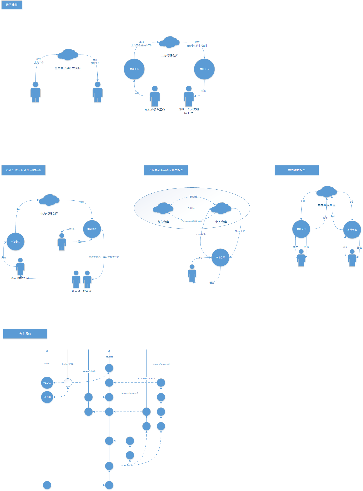

# Git

## 操作推荐
* 使用VSCode编辑提交日志，`git config --global 'core.editor code -w'`
* 使用`git merge <branch> --no-ff`进行分支合并

## Git日志规范
统一规范的日志利于后期的代码检查和问题排除，使用标准兼容的日志格式更能够与其他工具配合提高项目代码日志的规范性。推荐使用[Conventional Commits Specification](https://conventionalcommits.org/)
```
<type>[optional scope]: <description>

[optional body]

[optional footer(s)]
```
```
fix: correct minor typos in code

see the issue for details

on typos fixed.

Reviewed-by: Z
Refs #133
```

> The commit contains the following structural elements, to communicate intent to the consumers of your library:
> * **fix**: a commit of the type fix patches a bug in your codebase (this correlates with PATCH in semantic versioning).
> * **feat**: a commit of the type feat introduces a new feature to the codebase (this correlates with MINOR in semantic versioning).
> * **BREAKING CHANGE**: a commit that has a footer BREAKING CHANGE:, or appends a ! after the type/scope, introduces a breaking API change (correlating with MAJOR in semantic versioning). A BREAKING CHANGE can be part of commits of any type.
> * types other than fix: and feat: are allowed, for example [@commitlint/config-conventional](https://github.com/conventional-changelog/commitlint/tree/master/%40commitlint/config-conventional) (based on the the Angular convention) recommends chore:, docs:, style:, refactor:, perf:, test:, and others.
> * footers other than BREAKING CHANGE: <description> may be provided and follow a convention similar to [git trailer format](https://git-scm.com/docs/git-interpret-trailers)

Type | Description
-|-|
feat | 新增feature
fix | 修复bug
docs | 仅仅修改了文档，比如README, CHANGELOG, CONTRIBUTE等等
style | 仅仅修改了空格、格式缩进、都好等等，不改变代码逻辑
refactor | 代码重构，没有加新功能或者修复bug
perf | 优化相关，比如提升性能、体验
test | 测试用例，包括单元测试、集成测试等
chore | 改变构建流程、或者增加依赖库、工具等

## 使用commitlint+husky实现提交日志的规范检查
[commitlint](https://commitlint.js.org/)和[husky](https://github.com/typicode/husky)配合能够实现提交日志的规范检查

```json
// package.json
{
  "husky": {
    "hooks": {
      "commit-msg": "commitlint -E HUSKY_GIT_PARAMS"
    }  
  }
}
```

## 使用standard-version根据commit log自动生成Changelog
> [standard-version](https://github.com/conventional-changelog/standard-version):Automate versioning and CHANGELOG generation, with semver.org and conventionalcommits.org

## Git分支管理

### 分支类型
* master 主分之(生产环境分支)，确保任何时刻该分之上的代码都是可发布的稳定的，不允许直接提交代码到该分支。为实现更严格的控制可以添加权限，只有主程序员才可操作该分支，普通开发员无权限
* develop 开发分支，该分支上的代码是开发完成且经过测试(自测)的代码。在多人协作开发的场景下不建议直接在该分支上提交代码应该配合功能分支、预发布分支和补丁分支来进行代码的合并
* feature/FEATURE_NAME 功能分支
* release/vSEMATIC_VERSION 预发布分支
* hotfix/HOTFIX_NAME 补丁分支
* vMAJOR.MINOR.PATCH 版本标签

### 分支说明
分支类型 | 定义 | 作用 | 合并关系 | 建立时机 | 初始代码来源
-|-|-|-|-|-|
master | 主分支 | 记录每一个正式发布版本，TAG所在分支 | 允许来自release和hotfix分支的合并 | 仓库初始化 | 仓库初始化
develop | 开发分支 | 保持最新的经过自测的代码 | 允许来自feature、release和hotfix分支的合并 | master创建完成后 | master
release | 预发布分支 | 表示预发布在测试QA环境的分支，待测试人员进行测试 | 不允许来自任何分支的合并 | develop上代码满足发布要求 | 推荐使用develop上最新的commit
feature | 功能分支 | 开发独立的功能需求 | 不允许来自任何分支的合并 | 有独立的新功能需求时 | 推荐使用develop上最新的commit
hotfix | 补丁分支 | 修复已发布版本的bug | 不允许来自任何分支的合并 | 已发布版本出现BUG时 | master(或master上的TAG)

### Tips
* 远程仓库存在两个固定的分支master和develop，其他相关分支视情况而定在大部分情况下不会将功能分支、补丁分支和预发布分支上传到远程仓库
* 多人协作团队建议不直接在develop上提交代码
* 单人开发维护的项目可以适当的进行精简
* 使用命令行工具时使用`git merge --no-ff`进行分支合并
* 如果需要同步最新的代码可以使用`git rebase`来代替`git merge`
* 可以使用SourceTree图形化工具来进行管理，SourceTree提供gitflow的功能符合上述提及的分支管理策略的规范。使用SourceTree提供的gitflow功能在补丁分支使用时可以与GitHub的issue关联，如果确定修复了某个issue可以在提交日志中写`fix #ISSUE_NO`或`close #ISSUE_NO`等信息来直接关闭某个issue
